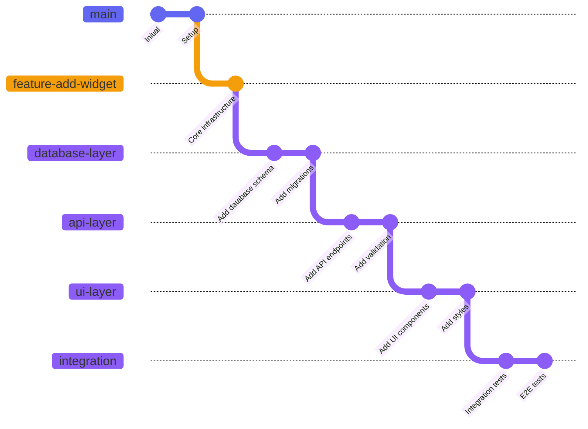
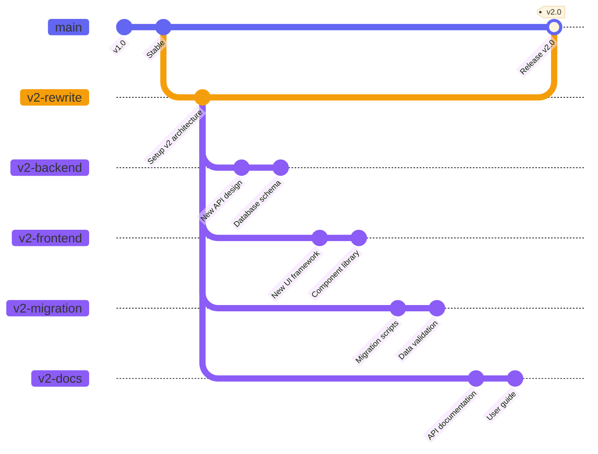
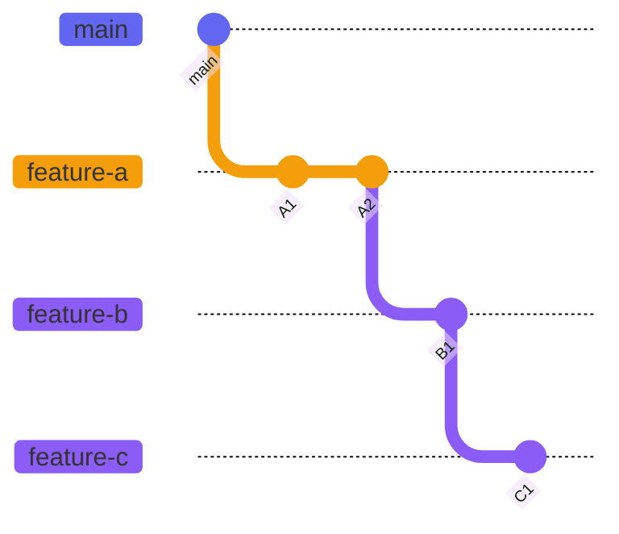
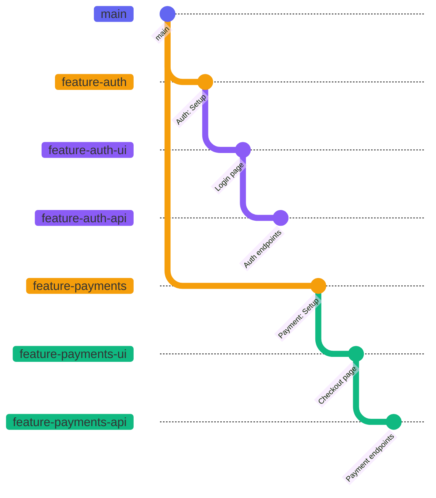

# Complex Multi-Level Stacks

PrStack excels at managing deep stacks where changes build on top of each other. Unlike traditional PR tools, PrStack dynamically discovers your stack regardless of depth.

## Deep Stack Example



In this example, you have a 5-level deep stack:

```
integration → ui-layer → api-layer → database-layer → foundation → main
```

Running `prstack sync` on this will prompt you to create 5 PRs, one for each feature branch onto the feature base branch and one more for the feature base branch onto master / main.

**Working with deep stacks:**

```bash
# From the integration branch, discover the entire stack
git checkout integration
prstack list

# Output:
# integration
# ui-layer
# api-layer
# database-layer
# foundation
# main

# Create all PRs in the chain
prstack create

# Creates:
# - foundation → main
# - database-layer → foundation
# - api-layer → database-layer
# - ui-layer → api-layer
# - integration → ui-layer
```

### Benefits of Multi-Level Stacks

1. **Logical separation**: Each PR focuses on one layer of abstraction
2. **Easier review**: Smaller, focused changes are easier to review
3. **Independent merging**: Lower levels can merge while higher levels are still in development
4. **Parallel work**: Multiple developers can work on different levels simultaneously

### When to Use Deep Stacks

- Building features that require multiple layers (database, API, UI)
- Implementing complex refactors that need incremental changes
- Creating large features that benefit from staged rollout
- Working on architectural changes that affect multiple parts of the system

## Feature Base Branches

For very large features, use feature bases to organize parallel work streams. See the [feature-base command](/docs/reference/feature-base) for detailed documentation.

## Megamerge Workflow

The [Megamerge Workflow](https://ofcr.se/jujutsu-merge-workflow) is a workflow that allows you to work simultaneously on multiple feature branches by creating something called a mega merge, a change which is a merge of multiple parallel branches. This allows you to see the result of all these changes combined, and offers benefits like catching merge conflicts early etc.. PR Stack is very suited for such workflows, with or without feature base branches.



**Setup:**

```bash
# Create feature base for v2 rewrite
prstack feature-base create v2-rewrite

# Multiple developers create branches off the feature base
git checkout -b v2-backend v2-rewrite
git checkout -b v2-frontend v2-rewrite
git checkout -b v2-migration v2-rewrite
git checkout -b v2-docs v2-rewrite

# Each branch can be developed and PR'd independently
git checkout v2-backend
prstack sync  # Creates PR: v2-backend → v2-rewrite

git checkout v2-frontend
prstack sync  # Creates PR: v2-frontend → v2-rewrite
```

**Merging:**

```bash
# Review and merge all component PRs into v2-rewrite
# (PRs target v2-rewrite, not main)

# When all components are complete and merged into v2-rewrite
# Remove the feature base designation
prstack feature-base remove v2-rewrite

# Create the final megamerge PR
git checkout v2-rewrite
prstack create
# Creates PR: v2-rewrite → main
```

# Rebasing Strategies

> **Note**: PRStack focuses on PR management, not commit history. Use your favorite tools (Git, Jujutsu, interactive rebase, etc.) to manage your tree structure and PRStack will pick up the changes. Below are some examples for how it can be used.

## Common Rebasing Scenarios

### Rebasing Entire Stack on Updated Trunk

```bash
# Trunk has new commits
git checkout main
git pull

# Rebase your entire stack
git checkout foundation  # Bottom of your stack
git rebase main

# Rebase each level on top of the previous
git checkout database-layer
git rebase foundation

git checkout api-layer
git rebase database-layer

# PrStack sync will push the updated branches
prstack sync
```

With **Jujutsu**, this is even easier:

```bash
# Update trunk
jj git fetch

# Rebase entire stack automatically
jj rebase -d main -s foundation

# Sync to update PRs
prstack sync
```

### Rebasing Mid-Stack Changes

If you update a middle branch in your stack, you may need to rebase descendants:



If `feature-a` gets new commits:

```bash
git checkout feature-a
# ... make changes ...
git commit -m "A3"

# Rebase descendants
git checkout feature-b
git rebase feature-a

git checkout feature-c
git rebase feature-b

# Update PRs
prstack sync
```

### Interactive Rebase for Cleanup

Clean up commits before review:

```bash
# Clean up feature-a commits
git checkout feature-a
git rebase -i main

# Clean up feature-b commits
git checkout feature-b
git rebase -i feature-a

# Force push the cleaned branches
prstack sync  # Use with --force if needed
```

## PrStack's Role in Rebasing

PrStack doesn't manage rebasing for you - it focuses on PR relationships:

- ✅ **PrStack handles**: Discovering your stack, creating PRs, syncing branches
- ❌ **PrStack doesn't handle**: Rebasing, resolving conflicts, rewriting history

This separation keeps PrStack simple and lets you use the best tools for each job.

# Parallel Development Workflows

## Working on Multiple Independent Stacks

You can have multiple independent stacks in your repository simultaneously:



PrStack discovers whichever stack you're currently working on:

```bash
# Work on auth stack
git checkout feature-auth-ui
prstack list
# Output:
# feature-auth-ui
# feature-auth
# main

# Switch to payments stack
git checkout feature-payments-api
prstack list
# Output:
# feature-payments-api
# feature-payments
# main
```

## Cross-Stack Dependencies

If stacks need to depend on each other, branch from the dependency:

```bash
# Payments depends on auth
git checkout feature-auth
git checkout -b feature-payments

# Now payments stack builds on auth
git checkout feature-payments-api
prstack list
# Output:
# feature-payments-api
# feature-payments
# feature-auth  ← dependency
# main
```

# Handling PR Merges in Stacks

When a PR in your stack is merged, you need to update dependent branches.

## Bottom-Up Merging (Recommended)

Merge PRs from bottom to top of your stack:

```
feature-c → feature-b → feature-a → main
```

1. Merge `feature-a → main`
2. Rebase `feature-b` onto `main`
3. Merge `feature-b → main`
4. Rebase `feature-c` onto `main`
5. Merge `feature-c → main`

**Workflow:**

```bash
# After feature-a is merged into main
git checkout main
git pull

# Update feature-b to target main instead
git checkout feature-b
git rebase main

# Update the PR base on GitHub (manual or via gh CLI)
gh pr edit <pr-number> --base main

# Continue with feature-c
git checkout feature-c
git rebase main
gh pr edit <pr-number> --base main
```

## Keeping Stack Structure (Alternative)

If you want to keep the stack structure for review purposes:

```bash
# After feature-a is merged
git checkout feature-b
git rebase main  # Rebase onto main, skipping feature-a commits

# feature-a commits are now in main, so feature-b PR shows only B changes
# PR base stays as feature-a (which now == main + A changes)
```

# Handling Merge Conflicts

When rebasing or syncing, conflicts may occur:

```bash
# Conflict during rebase
git checkout feature-b
git rebase feature-a
# CONFLICT (content): Merge conflict in file.txt

# Resolve conflicts using your preferred method
git status
vim file.txt  # or use your merge tool

# Continue rebase
git add file.txt
git rebase --continue

# Update PR
prstack sync
```

## Conflict Prevention Strategies

1. **Keep stacks focused**: Minimize overlap between stack levels
2. **Sync frequently**: Regular syncs reduce conflict complexity
3. **Rebase early**: Don't let branches diverge too far
4. **Communicate**: Coordinate changes with team members working on related branches

# Integration with CI/CD

## Testing Stacked PRs

Each PR in a stack can be tested independently:

```yaml
# .github/workflows/pr-test.yml
name: PR Tests
on: pull_request

jobs:
  test:
    runs-on: ubuntu-latest
    steps:
      - uses: actions/checkout@v3
      - run: npm test
```

Since each PR is based on its parent, tests run against the cumulative changes.

## Conditional Merging

Use GitHub branch protection to enforce order:

```bash
# Require feature-a to be merged before feature-b
# Set branch protection rules on main to require:
# - All checks pass
# - Required reviews
# - Up-to-date branches
```

## Auto-Updating PR Bases

When a stack PR merges, automatically update dependent PRs:

```yaml
# .github/workflows/update-stack.yml
name: Update Stack PRs
on:
  pull_request:
    types: [closed]

jobs:
  update-dependent-prs:
    if: github.event.pull_request.merged == true
    runs-on: ubuntu-latest
    steps:
      - name: Update dependent PR bases
        run: |
          # Custom logic to update PR bases
          # Use gh CLI or GitHub API
```

# Tips for Advanced Workflows

## 1. Name Branches Descriptively

```bash
# Good: Shows hierarchy
feature-auth
feature-auth-backend
feature-auth-frontend

# Bad: Hard to understand relationships
auth
backend
frontend
```

## 2. Use Feature Bases for Big Features

If you find yourself with more than 5 branches in a stack, consider using a feature base to organize the work.

## 3. Document Stack Structure

Add comments to your PRs explaining the stack:

```markdown
# Stack Position

This PR is part of the user authentication stack:
- #123 feature-auth → main (foundation)
- #124 feature-auth-backend → feature-auth (this PR)
- #125 feature-auth-frontend → feature-auth (parallel)
```

## 4. Keep PR Sizes Reasonable

Even in deep stacks, keep individual PRs small:
- Aim for < 500 lines changed per PR
- One logical change per PR
- Stack depth is fine; PR size should be small

## 5. Use Draft PRs for WIP

Mark PRs as draft while the stack is still being developed:

```bash
gh pr create --draft --base feature-auth --title "WIP: Auth backend"
```

Convert to ready when the entire stack is complete.

# See Also

- [Feature Base Command](/docs/reference/feature-base) - Managing feature base branches
- [Basic Workflow](/docs/basic-workflows) - Getting started with PrStack
- [prstack sync](/docs/reference/sync) - Syncing your stack
- [Philosophy](/docs/philosophy) - Understanding PrStack's approach
