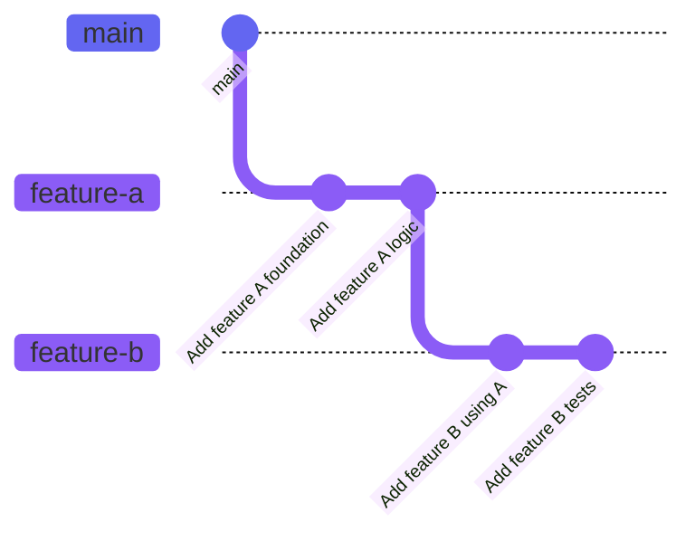

# PrStack

PRStack is a flexible tool that embraces the chaos of day to day development. It allows you to create any workflows your Version Control System (VCS) supports, and offers commands to manage Pull Requests (PR) based on the current state of the commit log.

It also supports a bunch of [workflows](/docs/workflows) that will make it a lot easier to make lots of small incremental Pull Requests. These workflows are also very suitable for modern parallelized AI powered development.

It's free and open source.

## Why PR Stacking

Development is an ongoing train of changes while an asynchronous review process goes on. When a feature gets done and a PR is submitted, you likely need to start working on the next thing. Often you'll want to keep working from where you were, so you make a new branch from your previous branch. This is the start of PR stacking. If a review process takes long enough, you may be 4 branches in and then things get more complicated to manage. After a review some PRs may get merged, some may not, so your stack is ever changing. If you merge from the Github UI, your local stack is outdated with the remote.



Especially if you need to go back and make alterations based on review outputs, I recommend using [Jujutsu](https://github.com/martinvonz/jj) as it makes changing history, editing a past change or inserting a node early in a stack with auto rebasing easy. It also supports some advanced workflows like the [Megamerge Workflow](/docs/workflows/megamerge-workflow). Since Jujutsu makes managing your git log more like tending to a tree, or sculpting, I felt it needed a tool for managing these complex stacks and workflows to match the branchless and quick approach Jujutsu.

## How to use PR Stack

After any changes to both your commit log or managing PRs in Github, you can always run `prstack sync` will then be sure to help

## CLI and TUI app

PrStack offers two ways to work:
- **TUI App**: Run `prstack` for an interactive terminal interface to detect, navigate, and manage your stacks with visual diffs, PR creation, merging, and more
- **CLI Commands**: Use individual commands like `prstack sync` for quick, scriptable operations in your existing workflow

## Benefits

Using PRStack reduces the overhead of creating and merging PRs to a mere afterthought. Wether you make a few PRs here and there, or are in active development creating dozens of PRs per week, PRStack provides all the regular actions at the press of a button.

## How it works

import { Step, Steps } from 'fumadocs-ui/components/steps';

<Steps>
  <Step>
  Work on a feature. Make one or more branches, stacked, parallel or any mix
  </Step>
  <Step>
  At any moment, invoking `prstack` will read your commit history into a Directed Acyclic Graph (DAG)
  </Step>
  <Step>
  Using this DAG, PRStack can visualize and manage your PRs
  </Step>
</Steps>

## Reasoning

Traditional PR stacking tools require planning and adherence to predefined structures. PRStack recognizes that development is organic - you branch where needed, pivot when requirements change, and explore multiple approaches simultaneously. Making PRs is an afterthought. A good PR management tool comes in at the right time to help you manage them, when you are ready.

By dynamically discovering your stack based on your current context, PRStack eliminates the friction of imperative stack management.

## Quick Example

<Tabs items={['Jujutsu', 'Git']}>
  <Tab value="Jujutsu">

```bash
# Create feature-a branch
jj new -m "Feature A"
jj bookmark create feature-a
# Create feature-b branch
jj new -m "Feature B"
jj bookmark create feature-b
# From feature-b: sync discovers feature-b → feature-a → main
prstack sync
```

  </Tab>
  <Tab value="Git">

```bash
# Create feature-a branch
git checkout -b feature-a
# Create feature-b branch
git checkout -b feature-b
prstack sync
```

  </Tab>
</Tabs>


## Next Steps

- [Installation](/docs/installation) - Get started with PRStack
- [Workflows](/docs/workflows) - Learn to use PRStack along with some useful workflows
- [Philosophy](/docs/philosophy) - Understand how PrStack differs from other tools
- [Commands](/docs/commands/sync) - Learn the available commands
