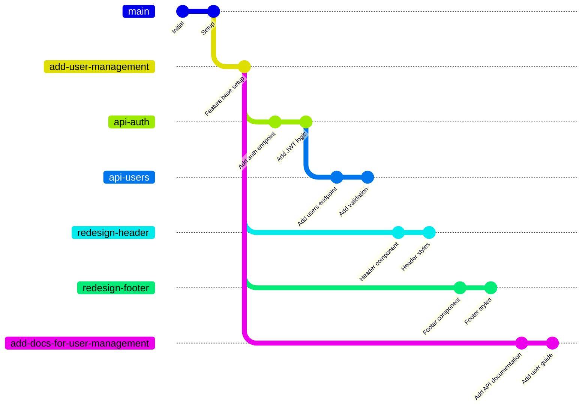

# prstack feature-base

Manage feature base branches in your repository. Feature base branches act as alternative trunk branches for organizing related work.

## Overview

Feature bases allow you to create stacks of work that branch from a point other than the main trunk. This is useful when:

- Working on a large feature that requires multiple PRs
- Organizing a series of changes that depend on an unmerged feature branch
- Creating experimental branches that should not yet target the main trunk

Once a feature base is configured, PrStack will treat it as a valid stopping point when discovering your stack, similar to how it treats the main trunk branch.

## Stack Visualization

Here's how feature bases enable parallel stacks of work:



In this example:
- **`add-user-management`** is a feature base branch for a large user management feature
- The following branches are stacked on the feature base:
  - A stack with both **api-auth** and **api-users** on top of `add-user-management`
  - **redesign-header** on top of `add-user-management` (header UI changes)
  - **redesign-footer** on top of `add-user-management` (footer UI changes)
  - **add-docs-for-user-management** on top of `add-user-management` (documentation)
- All work branches target the feature base instead of `main`
- When complete, `add-user-management` will have its own PR for final discussions before merging into `main`

## Subcommands

### `prstack feature-base list`

List all configured feature base branches.

```bash
prstack feature-base list
```

**Example output**:
```
feature-redesign
experimental-api
large-refactor
```

### `prstack feature-base add`

Add a branch as a feature base.

```bash
prstack feature-base add [branch-name]
```

If `branch-name` is not provided, you'll be prompted to select from available local branches.

**Example**:
```bash
prstack feature-base add feature-redesign

# Output:
# ✔ Added feature-redesign as a feature base branch
```

**With interactive selection**:
```bash
prstack feature-base add

# Prompts:
# Select feature base branch
# > feature-redesign
#   experimental-api
#   main
#   develop
```

### `prstack feature-base remove`

Remove a branch from feature bases.

```bash
prstack feature-base remove [branch-name]
```

If `branch-name` is not provided, you'll be prompted to select from configured feature bases.

**Example**:
```bash
prstack feature-base remove feature-redesign

# Output:
# ✔ Removed feature-redesign from feature base branches
```

### `prstack feature-base create`

Create a new feature base branch from the trunk.

```bash
prstack feature-base create <branch-name>
```

This command:
1. Creates a new branch from the current trunk
2. Automatically adds it as a feature base
3. Switches to the new branch

**Example**:
```bash
prstack feature-base create feature-redesign

# Output:
# Creating branch feature-redesign from main...
# ✔ Created and switched to feature-redesign
# ✔ Added feature-redesign as a feature base branch
```

## How It Works

Feature base branches are stored in your local `.prstack/config.edn` file under the `:feature-base-branches` key:

```clojure
{:feature-base-branches #{"feature-redesign" "experimental-api"}
 :ignored-branches #{}}
```

When PrStack discovers your stack, it will stop at any feature base branch, treating it as the "trunk" for that particular stack.

## Example Workflow

Here's a typical workflow using feature bases:

```bash
# Create a feature base for user management feature
prstack feature-base create add-user-management

# Create authentication branch
git checkout -b api-auth add-user-management
# ... implement auth endpoints ...
git commit -m "Add authentication endpoints"

# Create users API stacked on auth
git checkout -b api-users api-auth
# ... implement user CRUD ...
git commit -m "Add user management endpoints"

# Create UI branches off the feature base
git checkout add-user-management
git checkout -b redesign-header add-user-management
# ... update header for user management ...

# Discover your stack from api-users
git checkout api-users
prstack list
# Output:
# api-users
# api-auth
# add-user-management

# Create PRs for the entire stack
prstack create
# Creates PRs:
#   - api-auth → add-user-management
#   - api-users → api-auth
#   - redesign-header → add-user-management

# Later, when ready to merge the entire feature
prstack feature-base remove add-user-management
# Now add-user-management can target main
```

## Use Cases

### Large Feature Development

Break down a large feature into manageable PRs that all build on a common feature base:

```
api-users → api-auth → add-user-management
redesign-header → add-user-management
redesign-footer → add-user-management
add-docs-for-user-management → add-user-management
add-user-management → main
```

This allows you to:
- Review and merge individual components independently
- Work on frontend and backend in parallel
- Keep related work organized under one feature umbrella

### Experimental Work

Keep experimental branches separate from production:

```
experiment-3 → experiment-2 → experimental-api
experimental-api → main (created later when ready)
```

### Team Collaboration

Multiple developers can work on related changes targeting a shared feature base:

```
alice-auth-ui → auth-feature
bob-auth-api → auth-feature
auth-feature → main
```

## See Also

- [Configuration](/docs/configuration) - Learn about PrStack configuration
- [prstack sync](/docs/reference/sync) - Sync your stack including feature bases
- [prstack list](/docs/reference/list) - List your current stack
