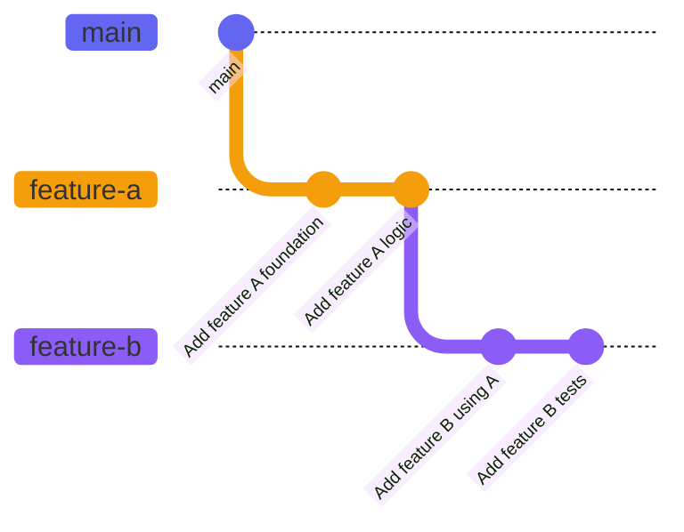
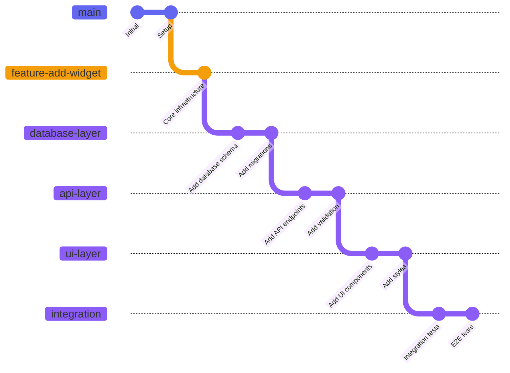
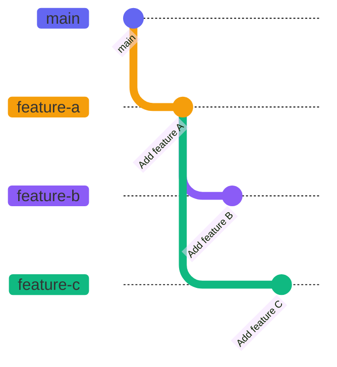

# Basic Workflow

This guide walks you through a typical PrStack workflow.

## Simple Stack Example

Here's a simple two-level stack where Feature B builds on Feature A:



This creates the stack: `feature-b → feature-a → main`

## Creating a Stack

Start by creating branches naturally as you would normally:

```bash
# Branch off main for feature A
git checkout main
git checkout -b feature-a

# Make some changes and commit
git commit -m "Add feature A foundation"
git commit -m "Add feature A logic"

# Branch off feature-a for feature B
git checkout -b feature-b

# Make some changes and commit
git commit -m "Add feature B using A"
git commit -m "Add feature B tests"
```

With **Jujutsu**, the workflow is even simpler:

```bash
# Create first change
jj new -m "Add feature A foundation"
jj bookmark create feature-a

# Create second change building on the first
jj new -m "Add feature B using A"
jj bookmark create feature-b
```

## Syncing Your Stack

When you're ready to create PRs, run sync:

```bash
prstack sync
```

This will:
1. Fetch latest changes from remote
2. Update your local trunk (main)
3. Discover your stack: `feature-b → feature-a → main`
4. Ask if you want to rebase on trunk (if trunk changed)
5. Push your branches
6. Offer to create missing PRs

## Creating PRs

When prompted to create PRs, PrStack will:

- Create a PR for `feature-a` targeting `main`
- Create a PR for `feature-b` targeting `feature-a`

This ensures your PRs are properly chained.

## Deep stack example



In this example, you have a 5-level deep stack:

```
main → foundation → database-layer → api-layer → ui-layer → integration
```

Running `prstack create` on this will prompt you to push and create 5 PRs, one for each feature branch onto the feature base branch and one more for the feature base branch onto master / main.

**Working with deep stacks:**

```bash
# From the integration branch, discover the entire stack
git checkout integration
prstack list

# Output:
# integration
# ui-layer
# api-layer
# database-layer
# foundation
# main

# Create all PRs in the chain
prstack create

# Creates:
# - foundation → main
# - database-layer → foundation
# - api-layer → database-layer
# - ui-layer → api-layer
# - integration → ui-layer
```

## Benefits of Multi-Level Stacks

1. **Logical separation**: Each PR focuses on one layer of abstraction
2. **Easier review**: Smaller, focused changes are easier to review
3. **Independent merging**: Lower levels can merge while higher levels are still in development
4. **Parallel work**: Multiple developers can work on different levels simultaneously

## When to Use Deep Stacks

- Building features that require multiple layers (database, API, UI)
- Implementing complex refactors that need incremental changes
- Creating large features that benefit from staged rollout
- Working on architectural changes that affect multiple parts of the system

## Feature Base Branches

For very large features, use feature bases to organize parallel work streams. See the [feature-base command](/docs/reference/feature-base) for detailed documentation.

## Branching Off Mid-Stack

One of PrStack's strengths is adapting to changes:

```bash
# Switch back to feature-a
git checkout feature-a

# Create a new branch off feature-a
git checkout -b feature-c

# Sync from this new context
prstack sync

# Discovers: feature-c → feature-a → main
# (feature-b is not in this stack)
```



Now you have two independent stacks:
- `feature-b → feature-a → main`
- `feature-c → feature-a → main`

## Listing Your Stack

At any time, check your current stack:

```bash
prstack list --include-prs
```

## Using the TUI

For a more interactive experience:

```bash
prstack
```

This launches the Terminal UI where you can:
- View your stack visually
- See diffs between branches
- Create, merge, and manage PRs interactively

## Tips

- **Run sync often**: It's safe to run `prstack sync` frequently
- **Branch anywhere**: Don't worry about planning your stack upfront
- **Let PrStack adapt**: Switch branches and run sync again - it will figure out your new context
- **Use the TUI for exploration**: When you want to understand your stack structure
- **Use CLI for speed**: When you know exactly what you want to do

## See Also

- [Megamerge Workflows](/docs/workflows/megamerge-workflows) - Working with parallel stacks and a mega merge commit
- [Feature Base Workflows](/docs/workflows/feature-base-workflows) - Managing stacks on top of a dedicated feature base branch
- [Merging](/docs/workflows/merging) - How to merge stacks when done
- [Tips](/docs/workflows/tips) - Best practices for workflow management
