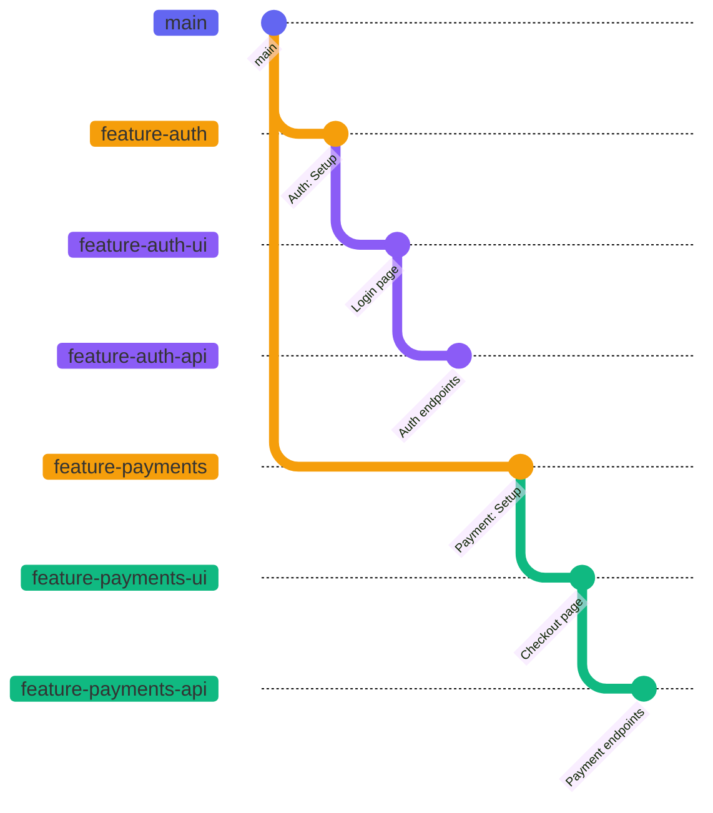

# Parallel Development Workflows

## Working on Multiple Independent Stacks

You can have multiple independent stacks in your repository simultaneously:



PrStack discovers whichever stack you're currently working on:

```bash
# Work on auth stack
git checkout feature-auth-ui
prstack list
# Output:
# feature-auth-ui
# feature-auth
# main

# Switch to payments stack
git checkout feature-payments-api
prstack list
# Output:
# feature-payments-api
# feature-payments
# main
```

## Cross-Stack Dependencies

If stacks need to depend on each other, branch from the dependency:

```bash
# Payments depends on auth
git checkout feature-auth
git checkout -b feature-payments

# Now payments stack builds on auth
git checkout feature-payments-api
prstack list
# Output:
# feature-payments-api
# feature-payments
# feature-auth  ← dependency
# main
```

## Benefits of Parallel Stacks

1. **Context switching**: Work on different features without interference
2. **Independent progress**: Features can move forward at their own pace
3. **Team coordination**: Multiple team members can work on separate stacks
4. **Reduced conflicts**: Independent stacks minimize merge conflicts

## Managing Multiple Stacks

### Keeping Track

Use descriptive branch names to identify which stack each branch belongs to:

```bash
# Auth stack
feature-auth
feature-auth-backend
feature-auth-frontend

# Payments stack
feature-payments
feature-payments-backend
feature-payments-frontend
```

### Switching Between Stacks

PrStack automatically detects your current context:

```bash
# Work on auth
git checkout feature-auth-backend
prstack sync  # Only syncs auth stack

# Switch to payments
git checkout feature-payments-frontend
prstack sync  # Only syncs payments stack
```

### Syncing All Stacks

To update all your stacks at once, you can script it:

```bash
# Sync multiple stacks
for branch in feature-auth feature-payments; do
  git checkout $branch
  prstack sync
done
```

## See Also

- [Multi-Level Stacks](/docs/workflows/multi-level-stacks) - Building deep stacks
- [Basic Workflow](/docs/workflows/basic) - Getting started with PrStack
- [Tips](/docs/workflows/tips) - Best practices for workflow management
