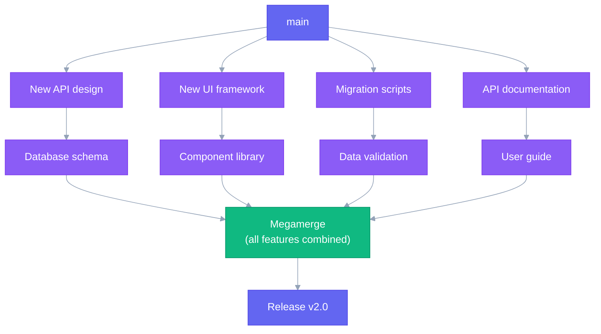

## Megamerge Workflow

The [Megamerge Workflow](https://ofcr.se/jujutsu-merge-workflow) is a workflow that allows you to work simultaneously on multiple feature branches by creating something called a mega merge, a change which is a merge of multiple parallel branches. This allows you to see the result of all these changes combined, and offers benefits like catching merge conflicts early etc.. PR Stack is very suited for such workflows, with or without feature base branches.




This may seem like a daunting structure at first, but Jujutsu makes it trivial to maintain such a structure and squash or move changes back the correct stack. Git would make this a bit harder requiring lots of rebase operations, which is why traditional pr stacking tools feel more rigid. I recommend using Jujutsu for implementing such a workflow.

As soon as you start having a few parallel stacks, I recommend trying this out. This setup offers the following **benefits**:

- You work on the combination of all your changes together
- Prevent and catch conflicts early
- Still allows to create smaller PRs

**Setup:**

```bash
# Multiple developers create branches off the feature base
git checkout -b v2-backend v2-rewrite
git checkout -b v2-frontend v2-rewrite
git checkout -b v2-migration v2-rewrite
git checkout -b v2-docs v2-rewrite

# Each branch can be developed and PR'd independently
git checkout v2-backend
prstack sync  # Creates PR: v2-backend → v2-rewrite

git checkout v2-frontend
prstack sync  # Creates PR: v2-frontend → v2-rewrite
```

**Merging:**

```bash
# Review and merge all component PRs into v2-rewrite
# (PRs target v2-rewrite, not main)

# When all components are complete and merged into v2-rewrite
# Remove the feature base designation
prstack feature-base remove v2-rewrite

# Create the final megamerge PR
git checkout v2-rewrite
prstack create
# Creates PR: v2-rewrite → main
```
