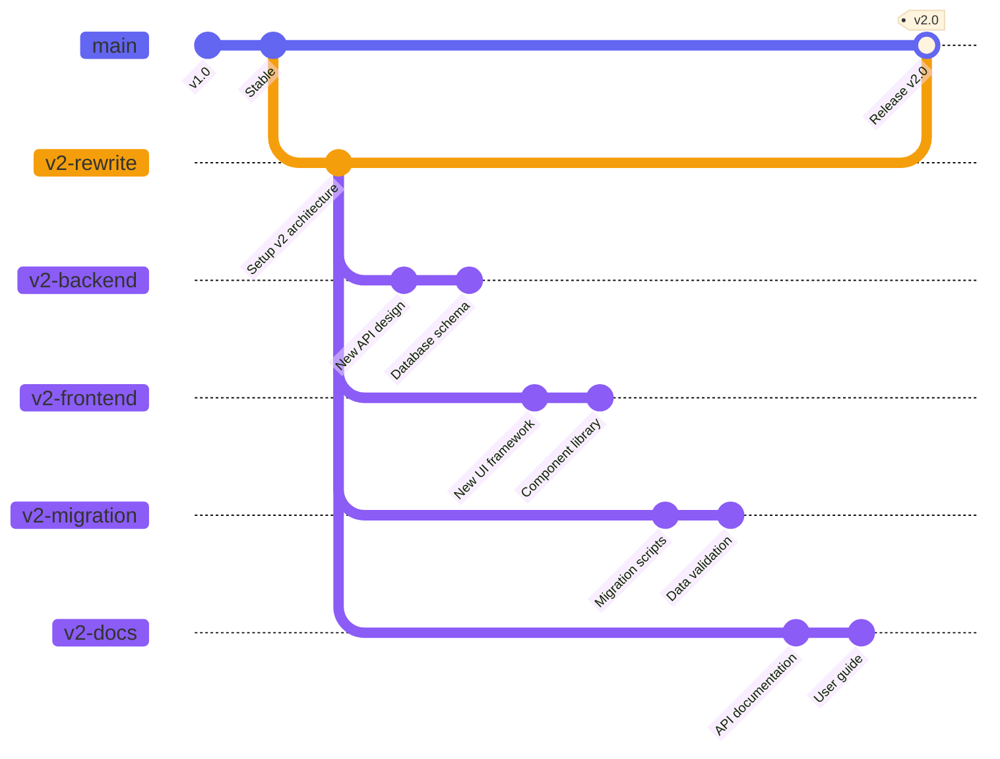

## Megamerge Workflow

The [Megamerge Workflow](https://ofcr.se/jujutsu-merge-workflow) is a workflow that allows you to work simultaneously on multiple feature branches by creating something called a mega merge, a change which is a merge of multiple parallel branches. This allows you to see the result of all these changes combined, and offers benefits like catching merge conflicts early etc.. PR Stack is very suited for such workflows, with or without feature base branches.



**Setup:**

```bash
# Create feature base for v2 rewrite
prstack feature-base create v2-rewrite

# Multiple developers create branches off the feature base
git checkout -b v2-backend v2-rewrite
git checkout -b v2-frontend v2-rewrite
git checkout -b v2-migration v2-rewrite
git checkout -b v2-docs v2-rewrite

# Each branch can be developed and PR'd independently
git checkout v2-backend
prstack sync  # Creates PR: v2-backend → v2-rewrite

git checkout v2-frontend
prstack sync  # Creates PR: v2-frontend → v2-rewrite
```

**Merging:**

```bash
# Review and merge all component PRs into v2-rewrite
# (PRs target v2-rewrite, not main)

# When all components are complete and merged into v2-rewrite
# Remove the feature base designation
prstack feature-base remove v2-rewrite

# Create the final megamerge PR
git checkout v2-rewrite
prstack create
# Creates PR: v2-rewrite → main
```

## See Also

- [Feature Base Command](/docs/reference/feature-base) - Managing feature base branches
- [Basic Workflow](/docs/workflows/basic) - Getting started with PrStack
- [Parallel Development](/docs/workflows/parallel-development) - Working on multiple stacks
