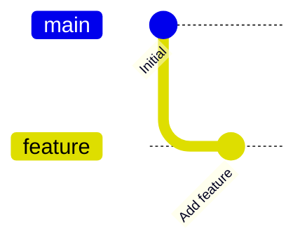

# Mermaid Diagrams

This directory contains Mermaid diagram source files (`.mmd`) for the PrStack documentation.

## Rendering Diagrams

Diagrams are automatically rendered in the documentation when using Mermaid code blocks in MDX files. However, you can also generate standalone SVG files for use elsewhere.

### In MDX Files (Recommended)

Simply use a `mermaid` code block in your MDX file:

````markdown

````

The diagram will be automatically rendered with the PrStack documentation theme.

### Generate SVG Files

To generate a standalone SVG file:

```bash
# Render to default output (same name with .svg extension)
./scripts/render-mermaid.sh diagrams/feature-base-example.mmd

# Render to specific output path
./scripts/render-mermaid.sh diagrams/feature-base-example.mmd public/images/diagram.svg
```

The generated SVG will use the PrStack documentation theme (dark mode with cyan/purple accents).

## Theme Configuration

The Mermaid theme is configured in `mermaid-config.json` to match the documentation site's design:

- **Background**: Deep purple-blue (`#0a0a14`)
- **Primary color**: Vibrant cyan (`#22d3ee`)
- **Secondary color**: Electric purple (`#c084fc`)
- **Text**: Light gray (`#d4d4e8`)
- **Borders**: Subtle purple-gray (`#252547`)

## Example Diagrams

- `feature-base-example.mmd` - Feature base branches with parallel stacks and stacked PRs
- `deep-stack.mmd` - Complex multi-level stack (5 levels deep)
- `megamerge-workflow.mmd` - Megamerge workflow using feature bases
- `mid-stack-rebase.mmd` - Rebasing mid-stack changes
- `parallel-stacks.mmd` - Multiple independent stacks in parallel
